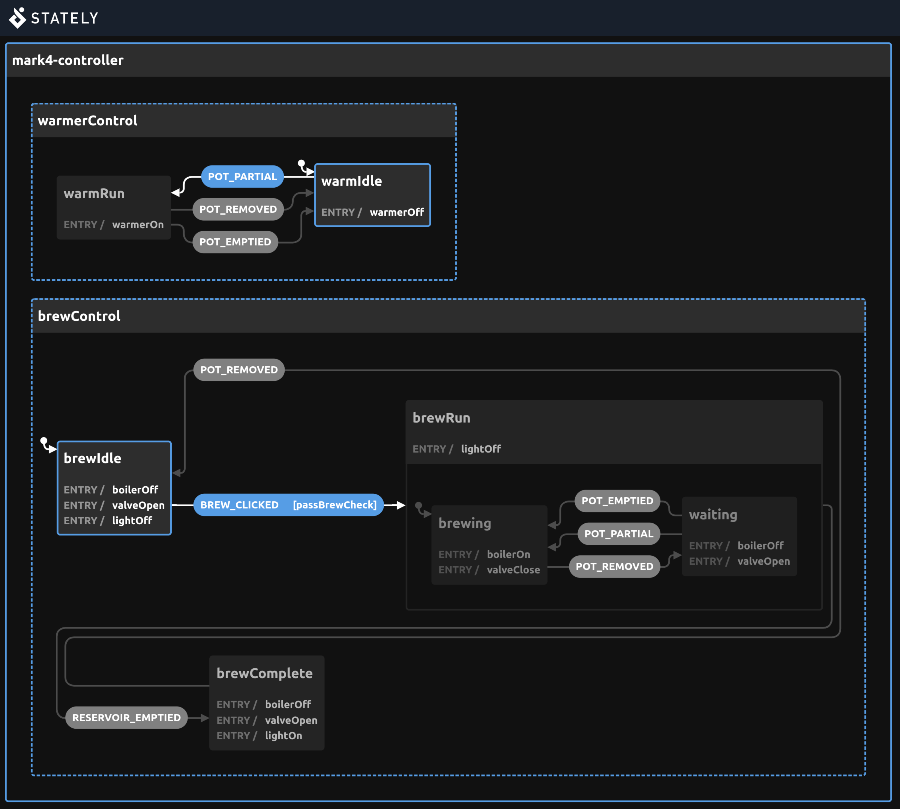

# xstate-mark4-a

An [XState](https://xstate.js.org/) implementation of the state charts found in [Jim Weirich](https://en.wikipedia.org/wiki/Jim_Weirich)'s paper [OOAD Design Problem: The Coffee Maker](./assets/mark4-jim-weirich.pdf) (1999).

The focus is on **state charts**—not class-based object orientation.

The state charts can be found on page 11 (Brew Controller) and 14 (Plate Controller; [Java](https://web.archive.org/web/20140220203309/http://onestepback.org/articles/depinj/java_coffee_maker/index.html) and [Ruby](https://web.archive.org/web/20140220203308/http://onestepback.org/articles/depinj/ruby_coffee_maker/index.html) implementations [from](https://web.archive.org/web/20140220202435/http://onestepback.org/articles/depinj/appendixb.html) Jim Weirich's OSCON 2005 talk [Dependency Injection: Vitally Important or Totally Irrelevant?](https://web.archive.org/web/20140220201711/http://onestepback.org/articles/depinj/index.html)).

The Mark IV Coffee Maker problem originates from Robert C. Martin's [Designing Object Oriented C++ Applications using the Booch Methodology](https://www.amazon.com/Designing-Object-Oriented-Applications-Using-Method/dp/0132038374) (1995) which also appeared as Chapter 11: [Heuristics and Coffee](./assets/mark4-robertc-martin.pdf) in [UML for Java Programmers](https://www.amazon.com/UML-Java%C2%BF-Programmers-Robert-Martin/dp/0131428489) (2003). 

Note that Weirich's implementation turns the indicator light off once the pot is removed after brewing is complete while Martin's implementation delays until the empty pot is returned. This could be addressed by adding `completedWarming`/`completedIdle` nested states under `brewComplete`. Initially starting with `completeWarming` transitioning to `completeIdle` on `POT_REMOVED` and back on `POT_PARTIAL`, exiting `brewComplete` on `POT_EMPTIED`, where `brewIdle` turns the light off.

## Objective:

* Practice implementing a state chart with [XState](https://xstate.js.org/) (using TypeScript) and verifying that it works as expected.

## Notes
* Reading Ian Horrock's [Constructing the User Interface with Statecharts](https://www.informit.com/store/constructing-the-user-interface-with-statecharts-9780201342789) (1999) (up to and including Chapter 6 "The statechart notation") was immensely helpful towards understanding how statecharts are represented, how they work, and how they mitigate issues encountered with plain finite state machines.
* [`src/index.ts`](./src/index.ts) holds the state chart configuration.
* [Parallel state nodes](https://xstate.js.org/docs/guides/parallel.html) are use to run `brewControl`/`warmerControl` side by side.
* [Hierarchical state nodes](https://xstate.js.org/docs/guides/hierarchical.html) are used for embedding the `brewing`/`waiting` states inside the `brewRun` state.
* [uvu](https://github.com/lukeed/uvu)'s [`Assertion`](https://github.com/lukeed/uvu/blob/master/docs/api.assert.md#user-content-assertionoptions) `Error` is used to implement a [custom assertion function](./tests/helpers/assert-state.ts).

<details><summary>Stately state chart</summary>

[](./assets/mark4-stately.jpg)

</details>

---

Clone the repo:
  ```
$ cd xstate-mark4-a
$ npm i
$ npm test
```
  
